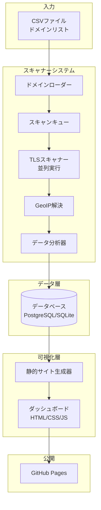

# 設計ドキュメント

## 概要

本システムは、大規模なドメイン（最大100万件）に対してSSL/TLS情報を収集・分析し、ダッシュボードで可視化するシステムです。スキャナー、データベース、ダッシュボードの3つの主要コンポーネントで構成されます。

### 設計目標

- 100万ドメインを週次でスキャン可能な性能
- 拡張性の高いアーキテクチャ
- OSSの積極的な活用
- GitHub Pagesでの静的サイトホスティング対応

## アーキテクチャ

### システム構成図



### 技術スタック

#### スキャナーシステム
- **言語**: Python 3.11+
- **TLSスキャン**: `sslyze` または `testssl.sh`のPythonラッパー
- **並列処理**: `asyncio` + `aiohttp` または `concurrent.futures`
- **GeoIP**: `geoip2` (MaxMind GeoLite2データベース)
- **スケジューリング**: `APScheduler` または cron

#### データベース
- **開発/小規模**: SQLite
- **本番/大規模**: PostgreSQL
- **ORM**: SQLAlchemy
- **マイグレーション**: Alembic

#### ダッシュボード
- **フレームワーク**: React + TypeScript または Vue.js
- **グラフライブラリ**: Chart.js または Recharts
- **地図ライブラリ**: Leaflet.js + GeoJSON
- **静的サイト生成**: Vite または Next.js (Static Export)
- **スタイリング**: Tailwind CSS

## コンポーネントとインターフェ
ース

### 1. ドメインローダー (Domain Loader)

**責務**: CSVファイルからドメインリストを読み込み、検証・正規化する

**インターフェース**:
```python
class DomainLoader:
    def load_from_csv(self, file_path: str) -> List[Domain]
    def validate_domain(self, domain: str) -> bool
    def deduplicate(self, domains: List[Domain]) -> List[Domain]
```

**処理フロー**:
1. `majestic_million.csv`を読み込み
   - フォーマット: `GlobalRank,TldRank,Domain,TLD,RefSubNets,RefIPs,...`
   - 必要なカラム: `GlobalRank`（1列目）、`Domain`（3列目）、`TLD`（4列目）
2. 各ドメインの形式検証
3. 重複除去
4. Domainオブジェクトのリストを返却

**Majestic Million CSVの扱い**:
- ヘッダー行をスキップ
- `Domain`カラムからドメイン名を抽出
- `TLD`カラムからトップレベルドメインを抽出
- `GlobalRank`カラムからランキング情報を抽出
- TLD情報をダッシュボードでの分析に活用（ccTLD別の統計など）

### 2. TLSスキャナー (TLS Scanner)

**責務**: 個別ドメインに対してSSL/TLS情報を収集する

**インターフェース**:
```python
class TLSScanner:
    def scan_domain(self, domain: str) -> ScanResult
    def detect_tls_versions(self, domain: str) -> List[TLSVersion]
    def detect_cipher_suites(self, domain: str) -> List[CipherSuite]
    def get_certificate_info(self, domain: str) -> CertificateInfo
    def detect_pqc_support(self, domain: str) -> PQCInfo
```

**使用するOSS**:
- `sslyze`: 高速で包括的なTLS/SSLスキャナー
- または `testssl.sh`: より詳細な脆弱性チェック

**並列実行戦略**:
- ワーカープール（例: 100並列）
- タイムアウト: 30秒/ドメイン
- リトライ: 最大2回
- エラーハンドリング: 失敗したドメインをログに記録し継続

### 3. GeoIP解決器 (GeoIP Resolver)

**責務**: ドメインのIPアドレスから地理情報を取得する

**インターフェース**:
```python
class GeoIPResolver:
    def resolve_ip(self, domain: str) -> str
    def get_location(self, ip: str) -> GeoLocation
```

**使用するOSS**:
- `geoip2`: MaxMind GeoLite2データベースのPythonライブラリ
- GeoLite2データベース（無料版）

### 4. データ分析器 (Data Analyzer)

**責務**: スキャン結果を分析し、追加情報を付与する

**インターフェース**:
```python
class DataAnalyzer:
    def classify_ca_type(self, ca_name: str) -> CAType
    def check_forward_secrecy(self, cipher_suites: List[CipherSuite]) -> bool
    def check_forward_secrecy(self, cipher_suites: List[CipherSuite]) -> bool
    def calculate_security_grade(self, scan_result: ScanResult) -> Tuple[str, float]  # Grade (A-F), Score (0-100)
    def identify_pqc_algorithms(self, cipher_suites: List[CipherSuite]) -> List[PQCAlgorithm]
    def identify_pqc_algorithms(self, cipher_suites: List[CipherSuite]) -> List[PQCAlgorithm]
```

**分析項目**:
- CA分類（無料CA vs 商用CA）
- Forward Secrecy対応判定
- PQ/Tハイブリッド暗号の詳細分析
- Forward Secrecy対応判定
- PQ/Tハイブリッド暗号の詳細分析
  - IANA TLS Parameters (Supported Groups) に定義されたValueに基づく判定
  - 例: X25519Kyber768Draft00 (0x6399) 等のコードポイント確認
- セキュリティグレード判定（独自基準）
  - **S (Safe & Future-proof)**: TLS 1.3 + PQC Hybrid + No Weak Ciphers
  - **A (Safe)**: TLS 1.2/1.3 + Strong Ciphers
  - **B (Acceptable)**: TLS 1.2 + Weak Ciphers (No Critical Vulnerabilities)
  - **F (Insecure)**: SSL 3.0/TLS 1.0/1.1 or Critical Vulnerabilities

### 5. データベースマネージャー (Database Manager)

**責務**: スキャン結果の永続化と履歴管理

**インターフェース**:
```python
class DatabaseManager:
    def save_scan_result(self, result: ScanResult) -> None
    def get_scan_history(self, domain: str) -> List[ScanResult]
    def get_monthly_statistics(self, year: int, month: int) -> Statistics
    def get_all_statistics(self) -> Statistics
```

### 6. 静的サイト生成器 (Static Site Generator)

**責務**: データベースから統計データを取得し、静的HTMLサイトを生成する

**インターフェース**:
```python
class StaticSiteGenerator:
    def generate_dashboard(self, output_dir: str) -> None
    def generate_monthly_report(self, year: int, month: int) -> None
    def export_data_as_json(self, output_dir: str) -> None
```

**生成物**:
- `index.html`: メインダッシュボード
- `data/*.json`: 統計データ（JSON形式）
- `assets/*`: CSS/JS/画像ファイル

## データモデル

### Domain
```python
@dataclass
class Domain:
    id: int
    name: str  # ドメイン名
    tld: str  # トップレベルドメイン（例: com, jp, uk）
    global_rank: Optional[int]  # Majestic Millionのランキング
    created_at: datetime
    updated_at: datetime
```

### ScanResult
```python
@dataclass
class ScanResult:
    id: int
    domain_id: int
    scan_date: datetime
    
    # 証明書情報
    certificate: CertificateInfo
    
    # TLSバージョン
    supported_tls_versions: List[TLSVersion]
    
    # 暗号スイート
    cipher_suites: List[CipherSuite]
    
    # PQ/T情報
    pqc_info: Optional[PQCInfo]
    
    # 地理情報
    geo_location: Optional[GeoLocation]
    
    # ステータス
    scan_status: ScanStatus  # SUCCESS, TIMEOUT, ERROR
    error_message: Optional[str]
    
    # セキュリティ評価
    grade: Optional[str]  # A+, A, B, C, F, etc.
    score: Optional[float]  # 0-100
```

### CertificateInfo
```python
@dataclass
class CertificateInfo:
    signature_algorithm: str  # RSA, ECDSA, EdDSA
    public_key_algorithm: str
    public_key_size: int  # ビット数
    issuer: str  # CA名
    ca_type: CAType  # FREE_CA, COMMERCIAL_CA
    valid_from: datetime
    valid_until: datetime
    is_valid: bool
```

### CipherSuite
```python
@dataclass
class CipherSuite:
    name: str
    key_exchange: str  # DHE, ECDHE, RSA, etc.
    authentication: str  # RSA, ECDSA, etc.
    encryption: str  # AES-GCM, ChaCha20-Poly1305, etc.
    mac: Optional[str]  # SHA256, SHA384, etc.
    is_forward_secret: bool
    is_weak: bool
    tls_version: TLSVersion
```

### PQCInfo
```python
@dataclass
class PQCInfo:
    is_supported: bool
    ml_kem_512: bool
    ml_kem_768: bool
    ml_kem_1024: bool
    supported_suites: List[str]  # PQ/Tハイブリッド暗号スイート名
    algorithm_combinations: List[str]  # 具体的なアルゴリズム組み合わせ
```

### GeoLocation
```python
@dataclass
class GeoLocation:
    ip_address: str
    country_code: str  # ISO 3166-1 alpha-2
    country_name: str
    region: Optional[str]
    city: Optional[str]
    latitude: float
    longitude: float
```

### Statistics
```python
@dataclass
class Statistics:
    scan_date: datetime
    total_domains: int
    successful_scans: int
    
    # TLSバージョン統計
    tls_version_distribution: Dict[TLSVersion, int]
    
    # 暗号スイート統計
    cipher_suite_distribution: Dict[str, int]
    forward_secrecy_rate: float
    
    # 証明書統計
    signature_algorithm_distribution: Dict[str, int]
    key_size_distribution: Dict[int, int]
    ca_type_distribution: Dict[CAType, int]
    
    # セキュリティ評価統計
    grade_distribution: Dict[str, int]
    average_score: float
    
    # PQ/T統計
    pqc_adoption_rate: float
    ml_kem_distribution: Dict[str, int]
    
    # 地域統計（GeoIPベース）
    geo_distribution: Dict[str, int]  # country_code -> count
    
    # TLD統計（Majestic Millionデータベース）
    tld_distribution: Dict[str, int]  # TLD -> count
    cctld_ssl_adoption: Dict[str, float]  # ccTLD別のSSL/TLS採用率
```

## データベーススキーマ

### テーブル設計

```sql
-- ドメインテーブル
CREATE TABLE domains (
    id SERIAL PRIMARY KEY,
    name VARCHAR(255) UNIQUE NOT NULL,
    tld VARCHAR(50) NOT NULL,  -- トップレベルドメイン
    global_rank INTEGER,  -- Majestic Millionのランキング
    created_at TIMESTAMP DEFAULT CURRENT_TIMESTAMP,
    updated_at TIMESTAMP DEFAULT CURRENT_TIMESTAMP,
    INDEX idx_global_rank (global_rank),
    INDEX idx_tld (tld)
);

-- スキャン結果テーブル
CREATE TABLE scan_results (
    id SERIAL PRIMARY KEY,
    domain_id INTEGER REFERENCES domains(id),
    scan_date TIMESTAMP NOT NULL,
    scan_status VARCHAR(50) NOT NULL,
    error_message TEXT,
    grade VARCHAR(5),
    score DECIMAL(5, 2),
    created_at TIMESTAMP DEFAULT CURRENT_TIMESTAMP,
    INDEX idx_domain_scan_date (domain_id, scan_date),
    INDEX idx_scan_date (scan_date)
);

-- 証明書情報テーブル
CREATE TABLE certificates (
    id SERIAL PRIMARY KEY,
    scan_result_id INTEGER REFERENCES scan_results(id),
    signature_algorithm VARCHAR(100),
    public_key_algorithm VARCHAR(100),
    public_key_size INTEGER,
    issuer VARCHAR(255),
    ca_type VARCHAR(50),
    valid_from TIMESTAMP,
    valid_until TIMESTAMP,
    is_valid BOOLEAN
);

-- TLSバージョンテーブル
CREATE TABLE tls_versions (
    id SERIAL PRIMARY KEY,
    scan_result_id INTEGER REFERENCES scan_results(id),
    version VARCHAR(50) NOT NULL,
    is_supported BOOLEAN NOT NULL
);

-- 暗号スイートテーブル
CREATE TABLE cipher_suites (
    id SERIAL PRIMARY KEY,
    scan_result_id INTEGER REFERENCES scan_results(id),
    name VARCHAR(255) NOT NULL,
    key_exchange VARCHAR(100),
    authentication VARCHAR(100),
    encryption VARCHAR(100),
    mac VARCHAR(100),
    is_forward_secret BOOLEAN,
    is_weak BOOLEAN,
    tls_version VARCHAR(50)
);

-- PQ/T情報テーブル
CREATE TABLE pqc_info (
    id SERIAL PRIMARY KEY,
    scan_result_id INTEGER REFERENCES scan_results(id),
    is_supported BOOLEAN NOT NULL,
    ml_kem_512 BOOLEAN,
    ml_kem_768 BOOLEAN,
    ml_kem_1024 BOOLEAN,
    supported_suites TEXT,  -- JSON array
    algorithm_combinations TEXT  -- JSON array
);

-- 地理情報テーブル
CREATE TABLE geo_locations (
    id SERIAL PRIMARY KEY,
    scan_result_id INTEGER REFERENCES scan_results(id),
    ip_address VARCHAR(45),
    country_code VARCHAR(2),
    country_name VARCHAR(100),
    region VARCHAR(100),
    city VARCHAR(100),
    latitude DECIMAL(10, 8),
    longitude DECIMAL(11, 8)
);

-- 統計キャッシュテーブル（パフォーマンス最適化用）
CREATE TABLE statistics_cache (
    id SERIAL PRIMARY KEY,
    scan_date DATE UNIQUE NOT NULL,
    statistics_json TEXT NOT NULL,  -- JSON形式の統計データ
    created_at TIMESTAMP DEFAULT CURRENT_TIMESTAMP
);
```

## エラーハンドリング

### エラー分類

1. **ドメイン解決エラー**: DNSルックアップ失敗
2. **接続エラー**: タイムアウト、接続拒否
3. **TLSハンドシェイクエラー**: プロトコルエラー、証明書エラー
4. **データベースエラー**: 書き込み失敗、接続エラー

### エラー処理戦略

- すべてのエラーをログに記録
- スキャン結果に`scan_status`と`error_message`を保存
- エラーが発生しても次のドメインの処理を継続
- 致命的なエラー（DB接続不可等）の場合のみ処理を中断

## テスト戦略

### ユニットテスト
- 各コンポーネントの個別機能テスト
- モックを使用した外部依存の分離
- カバレッジ目標: 80%以上

### 統合テスト
- スキャナーとデータベースの連携テスト
- 実際のテストドメインを使用したエンドツーエンドテスト

### パフォーマンステスト
- 10,000ドメインのスキャン時間測定
- 並列度の最適化
- データベースクエリのパフォーマンス測定

## デプロイメント

### スキャナーシステム
- **環境**: Linux サーバー（Ubuntu 22.04 LTS推奨）
- **実行方法**: cronまたはsystemd timer
- **入力ファイル**: `majestic_million.csv`（Majestic Millionから取得）
- **設定ファイル**: `config.yaml`
  - データベース接続情報
  - スキャン並列度
  - タイムアウト設定
  - GeoIPデータベースパス
  - CA分類ルール
  - CSVファイルパス（デフォルト: `./data/majestic_million.csv`）

### ダッシュボード
- **ホスティング**: GitHub Pages
- **デプロイ**: GitHub Actions
- **更新頻度**: 週次（スキャン完了後）

### GitHub Actions ワークフロー

```yaml
name: Update Dashboard

on:
  schedule:
    - cron: '0 0 * * 0'  # 毎週日曜日 00:00 UTC
  workflow_dispatch:  # 手動実行も可能

jobs:
  scan-and-deploy:
    runs-on: ubuntu-latest
    steps:
      - name: Checkout
        uses: actions/checkout@v3
      
      - name: Setup Python
        uses: actions/setup-python@v4
        with:
          python-version: '3.11'
      
      - name: Install dependencies
        run: pip install -r requirements.txt
      
      - name: Run scanner
        run: python scanner/main.py --config config.yaml
      
      - name: Generate dashboard
        run: python generator/main.py --output docs/
      
      - name: Deploy to GitHub Pages
        uses: peaceiris/actions-gh-pages@v3
        with:
          github_token: ${{ secrets.GITHUB_TOKEN }}
          publish_dir: ./docs
```

## セキュリティ考慮事項

### スキャナー側
- レート制限の実装（同一ドメインへの過度なアクセス防止）
- User-Agentの設定（スキャナーであることを明示）
- robots.txtの尊重（オプション）

### データベース
- 接続情報の環境変数管理
- 最小権限の原則（読み取り専用ユーザーの作成）

### ダッシュボード
- 個別ドメイン名の公開範囲の検討
- 集計データのみの公開も検討

## パフォーマンス最適化

### スキャン速度
- 並列度: 100-200並列（ネットワーク帯域に応じて調整）
- 100万ドメインの想定スキャン時間: 約3-5時間
  - 1ドメインあたり平均10秒
  - 100並列の場合: 1,000,000 / 100 / 3600 ≈ 2.8時間

### データベース最適化
- インデックスの適切な設定
- 統計データのキャッシュ（`statistics_cache`テーブル）
- パーティショニング（scan_dateによる月次パーティション）

### ダッシュボード最適化
- 静的サイト生成によるサーバー負荷ゼロ
- JSONデータの圧縮（gzip）
- 遅延ロード（大きなデータセットの場合）

## 拡張性

### 将来の拡張ポイント

1. **スキャン対象の拡張**
   - STARTTLS（SMTP、IMAP等）のサポート
   - 443以外のポートのスキャン

2. **分析機能の拡張**
    - 脆弱性検出（Heartbleed, ROBOT等）
    - コンプライアンスチェック（PCI DSS, NIST等）

3. **可視化の拡張**
   - カスタムレポート生成
   - APIの提供
   - リアルタイムダッシュボード

4. **通知機能**
   - スキャン完了通知
   - 異常検知アラート

## 参考資料

- [sslyze Documentation](https://nabla-c0d3.github.io/sslyze/documentation/)
- [testssl.sh](https://testssl.sh/)
- [MaxMind GeoLite2](https://dev.maxmind.com/geoip/geolite2-free-geolocation-data)
- [SSL Pulse](https://www.ssllabs.com/ssl-pulse/)
- [Mozilla SSL Configuration Generator](https://ssl-config.mozilla.org/)
